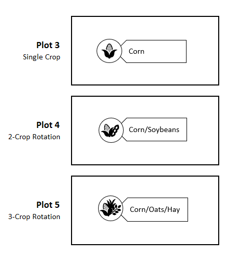
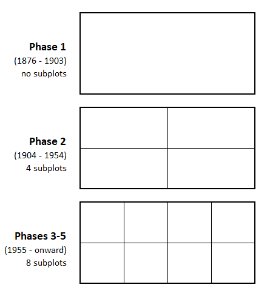

```{r, include = FALSE}
knitr::opts_chunk$set(
  collapse = TRUE,
  comment = "#>",
  rmarkdown.html_vignette.check_title = FALSE
)
```

```{r setup}
library(morrowplots)
```

**Don't worry if you don't know anything about agriculture.**

**Anyone can use this dataset to learn about data science and R.**

\

# The Experiment 

Established in 1876, the Morrow Plots at the University of Illinois Urbana Champaign are the longest-running continuous agricultural fields in the Americas. They test the impact of soil fertility treatments and crop rotation on corn, Illinois's most important crop. Data collection began in 1888 and has recorded planting, treatment, and yield data annually since then.

\

<iframe src="https://www.google.com/maps/embed?pb=!1m18!1m12!1m3!1d12206.811718411547!2d-88.23526687085335!3d40.10433587459286!2m3!1f0!2f0!3f0!3m2!1i1024!2i768!4f13.1!3m3!1m2!1s0x880cd716231139f5%3A0x2f0f6d23ae90f56b!2sMorrow%20Plots!5e0!3m2!1sen!2sus!4v1714768356406!5m2!1sen!2sus" width="600" height="450" style="border:0;" allowfullscreen="" loading="lazy" referrerpolicy="no-referrer-when-downgrade" data-external="1"></iframe>

\

Experiments like this one are essential for testing how common farming practices gradually impact soils and crops over several decades. Annual weather patterns can also have a big impact on crops, and the long timescale helps control for those weather-related variations from year to year. If you're using this dataset to learn about data science, the long-term nature of the experiment means there's enough data to explore trends, outliers, phases, and facets. There's something here for everyone.

{width=75%}

\

# The Dataset

The dataset is structured to reflect the way the actual crop field is organized and planted. The current field is separated into 3 plots - 3, 4, and 5. Originally, there were 10 plots, but over time plots 1,2 and 6-10 were for campus building projects as the university grew. This dataset contains data for the 3 enduring plots - plots 3, 4, and 5 - and covers 1888 through 2021. 

## Plots and Crop Rotation

Each plot tests a different crop rotation. Plot 3 grows corn every year. Plot 4 has a two-crop rotation that alternates every year. At first Plot 4 alternated between corn and oats. It changed to corn and soybeans in 1967. Plot 5 has a three-crop rotation of corn, oats, and hay. Over the years, the non-corn crops have changed somewhat to reflect changing farming practices, but the corn has remained consistent because it's the focus of the experiment. 

{width=50%}

\

## Subplots and Soil Treatments

Each of the 3 plots is divided into eight subplots - four Northern subplots (NA, NB, NC, and ND) and four Southern subplots (SA, SB, SC, and SD) - that test different fertility treatments like manure, limestone, and nitrogen. Some of the subplots have never received any treatments. Other subplots have received different treatments over different phases of the experiment. 

{width=50%}

\

## Yield and Other Variables

Each row of the dataset represents one year of data for one subplot, and records observations about the crop planted, the treatments employed, and the yields harvested. The key measure is yield, which is recorded as a rate of yield per acre. Different crops are measured differently, which is why there are two yield columns in the dataset - one for bushels per acre and one for tons per acre. Corn is the focus of the experiment, and is always measured in bushels. Yields for the other crops are included wherever possible, but in some years they weren't recorded. Null values like these are represented by NAs. There are many NAs in the dataset because some extra details - like the corn variety planted and the specific amount of treatment applied - were recorded for some years and not others. These extra details are included wherever possible. 

\

# Changes over Time

This experiment is designed to reflect common farming practices, which change over time. For example, originally the two-crop rotation in Plot 4 alternated between corn and oats. Oats were a popular crop because they were used to feed the horses and other draft animals that worked on farms. Over time machines replaced draft animals, and farmers replaced oats with commercial crops like soybeans. In 1967, the two-crop rotation changed to corn and soybeans to reflect the fact that soybeans had become the second-most popular crop in Illinois. 

## Phases

Major changes to the experiment are marked as different phases. This dataset includes data from phases 1-5. As phases changed and new treatment variables were added, the plots were divided into more and more subplots. In phase 1, the plots were untreated. Since there were no treatment variables, there was no need for different subplots. In phase 2, starting in 1904, the plots were divided into four subplots to test two treatments. In phase 3, starting in 1954, more treatment variables were introduced and the plots were split into eight subplots. They have stayed at eight subplots since then.

{width=50%}

\

## Consistency

**Even though the plots haven't always had eight subplots, every year in the dataset is broken up into eight subplots for consistency's sake.** This allows for longitudinal comparisons over the entire course of the experiment, and it's possible because yield was always recorded as a rate. It's also why some of the yield data looks duplicated. For example, look at the yield values for plot 3 in 1888. All eight subplots have the same yield value of 54.3 bushels per acre. That's because yield was only measured once for all of plot 3, but since it was measured as a rate of bushels per acre, that same rate applies to all of plot 3 and to any portion of it. It's like miles per hour - 50 mph is 50 mph whether you travel for one mile or 100 miles. Because yield was measured as a rate instead of a total count, we can structure the data so every year always has data for eight subplots, allowing for consistent comparisons across the entire course of the experiment.

## The Future

This experiment is still ongoing, and new data will be added to this package in future updates.

\

# More Information

**For links to other resources about the Morrow Plots, see the [Illinois Data Bank](https://doi.org/10.13012/B2IDB-7865141_V1).**

Image from the [University of Illinois Archives](https://archon.library.illinois.edu/archives/index.php?p=digitallibrary/digitalcontent&id=8607)


