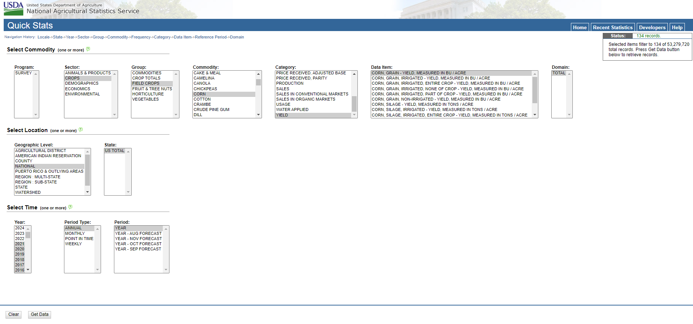
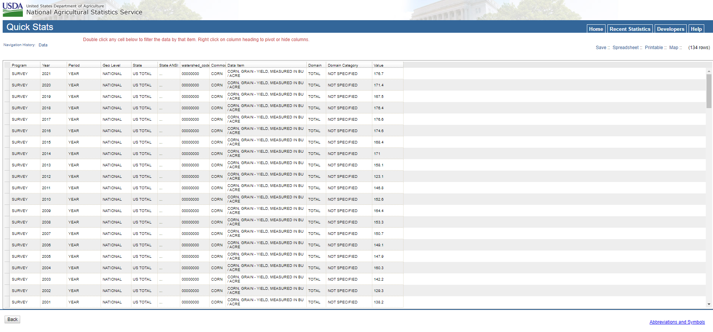

```{r, include = FALSE}
knitr::opts_chunk$set(
  collapse = TRUE,
  comment = "#>",
  error = TRUE
)
```

## How do corn yields at the Morrow Plots compare to the national average?

This exercise demonstrates how to use ggplot2 to create a graph comparing corn yields on the Morrow Plots to the U.S. national average. We'll use the data from the Morrow Plots R package, and we'll also download and import national average data from the National Agricultural Statistics Service (NASS).

In addition to the morrowplots package, this exercise also uses the dplyr and ggplot2 packages.

```{r setup}
library(morrowplots)
library(dplyr)
library(ggplot2)
```

\

## 1. Visualize the Morrow Plots data

First, let's take a look at the Morrow Plots data so you can see what we're working with.

```{r}
head(morrowplots)
```

\

**1.1 Import and subset the Morrow Plots data**

We'll be visualizing the corn yield data in the 'yield_bush' variable, but before we can compare corn yields, we need to narrow down the dataset. Plots 4 and 5 grow corn every 2 to 3 years, but plot 3 grows corn every year, so for the purposes of this exercise, we'll create a new subset of just data from plot 3. 

We also have a few years where 'yield_bush' data is missing and marked with 'NA'. We can filter those out too so they don't show up in our visualizations.

If you look at the Morrow Plots data, you'll see that each plot has multiple rows of data for each year. That's because each plot has subplots. Some subplots receive fertilizing treatments and some don't. This is recorded in the TRUE/FALSE 'treated' variable. For our purposes, we want the annual average yield, and because treatments affect yield, we'll calculate two annual averages - one for treated subplots and one for untreated subplots. None of the subplots received treatments from 1888 to 1903, so those years will only have one average for untreated subplots.  

```{r subset}
## name the new dataset mp3 for plot 3
mp3 <- 
  
  ## filter to only include rows where 'plot_num' is 3 and 'yield_bush' is not 'NA'
  dplyr::filter(morrowplots, plot_num == 3, !is.na(yield_bush))  %>% 

  ## condense the filtered data and group it first by 'year' and then by 'treated'
  dplyr::group_by(year, treated) %>% 

  ## calculate the average 'yield_bush' for each grouping
  ## and put that average in a new field called 'mp_ave'
  dplyr::summarise(mp_ave = mean(yield_bush))

head(mp3)
```

\

**1.2 Create a line graph for plot 3**

Now you should have a dataset called 'mp3' in your R environment, which contains annual averages for treated and untreated corn in plot 3. Huzzah!

We can visualize the plot 3 yields in a line graph with 'year' on the x axis and 'mp_ave' on the y axis. We'll use the 'treated' variable to plot treated and untreated corn with different colors.  

```{r mp3 line, fig.width=7}

ggplot2::ggplot(data = mp3) +
  ggplot2::geom_line(ggplot2::aes(x= year, y = mp_ave, color = treated))
```

\

**1.3 Smooth out the line graph**

Those lines are all over the place! So much so that it's kind of hard to read. 

Try the same parameters with geom_smooth() instead, which creates trend lines that makes it easier to view long-term trends in varied data.

```{r mp3 smooth, fig.width=7}

ggplot2::ggplot(data = mp3) +
  ggplot2::geom_smooth(ggplot2::aes(x= year, y = mp_ave, color = treated))
```

\

## 2. Download and import yield data from NASS

Much smoother! Notice how the axes of the two graphs differ. R automatically adjusts axes, so keep that in mind when comparing graphs.

Now that we know what the corn yield trends from plot 3 look like, we can add in national averages for comparison.

\

**2.1 Filter NASS data using parameters** 

For this exercise, we'll manually download national corn yield data from NASS. (Alternatively, there is a way to import it directly into R with code, but that requires registering with NASS to get an API key. For our purposes, downloading it manually is easier.)

To download NASS data manually, go to the [NASS Quick Stats webpage](https://quickstats.nass.usda.gov/). You should see dataset parameters similar to those pictured below. 

Note: some parameters won't appear until you make a selection in the preceding parameter.

{width=100%}

\

For Commodity parameters select:

* Program: SURVEY
* Sector: CROPS
* Group: FIELD CROPS
* Commodity: CORN
* Category: YIELD
* Data Item: CORN, GRAIN - YIELD, MEASURED IN BU/ACRE
* Domain: TOTAL

For Location parameters select:

* Geographic Level: NATIONAL
* State: US TOTAL

For Time parameters select:

* Year: 1888-2021 (select 2021, hold Shift and select 1888)
* Period: YEAR

Click the 'Get Data' button. The resulting dataset should have 134 rows and look like this.

{width=100%}

\

In the upper right, click 'Spreadsheet' to download the data as a csv.

Once downloaded, rename it something sensible like 'NASS_data.csv' and put it in your working directory for R.

\

**2.2 Import NASS data into R**

Read in the csv file and name the imported dataset 'NASS'.

```{r import NASS}

NASS <- read.csv("NASS_data.csv")
head(NASS)

```

\

**2.3 Combine NASS and mp3 data**

The NASS data contains a whole bunch of stuff we don't need, so first we'll pare it down to just 'Year' and 'Value'. While we're doing that, we'll also rename the NASS variables. We'll change 'Year' to 'year' so it matches the variable in mp3 exactly (we need that for the next step), and we'll change 'Value' to 'nat_ave' for national average.

Once NASS is pared down, we'll add the 'nat_ave' variable to the mp3 dataset and match the data up by 'year'.

```{r add NASS}

## remove everything from NASS except 'Year' and 'Value'
NASS <- dplyr::select(NASS, year = Year, nat_ave = Value)

mp3_NASS <-
  mp3 %>% 
  dplyr::left_join(NASS, by = "year")

head(mp3_NASS)
```

\

## 3. Add national data to the Morrow Plots graph

You should now have NASS and mp3_NASS datasets in your R environment. You may pause here to perform the celebratory dance of your choice.

\

**3.1 Plotting the combined data**

We can now recreate our geom_smooth graph from above using the mp3_NASS data, and add a black dashed line to show the national average.

Since this is our final graph, we can also add a title and subtitle to provide context, and a built-in theme to change the look of the graph.

```{r plot both, fig.width=7}

ggplot2::ggplot(data = mp3_NASS) +
  
  ## mp_ave color coded by 'treated'
  ggplot2::geom_smooth(ggplot2::aes(x= year, y = mp_ave, color = treated))+
  
  ## add nat_ave as a dashed black line in the same graph
  ggplot2::geom_smooth(ggplot2::aes(x= year, y = nat_ave), linetype = "dashed", color = "black")+
  
  ## add title and subtitle
  ggplot2::labs(title = "Morrow Plots Continuous Corn Yield Trends in Bushels per Acre",
       subtitle = "Compared to the U.S. national average (dashed line)"
       )+
  
  ## add one of the built-in themes
  ggplot2::theme_light()
  
```

\

**3.2 Interpreting the Results**

Now that you have a combined graph, how does the data compare?

The untreated continuous corn (that's where corn is grown every single year with no fertilizing treatments) starts out performing slightly better than the national average, but starts to dip over time as the untreated soil is depleted. Even so, Illinois soil is so rich that the untreated corn is pretty similar to the national average until the late 1930's when the national average starts to rise up and break away. Why is that? One reason is that around that time, hybrid corn was introduced, and it performed better than previously popular corn breeds. Hybrid corn was introduced into the Morrow Plots in 1937, which is one reason why we see both the treated and untreated yields start to rise after that.

The treated continuous corn rises a lot higher than the untreated yields, but why does it eventually plateau while the national average keeps rising? One reason is the other major variable in the Morrow Plots experiment - crop rotation. Planting corn year after year eventually depletes the soil, even when the soil is treated. This graph only includes data from continuous corn. If you repeat these steps with corn yields from plot 4 or 5, both of which rotate corn with other crops, you'd see that those plots perform better over the long term.

You did it! You combined datasets and graphs, plus you bothered to read through the interpretation, which shows you really care about data. Well done!
