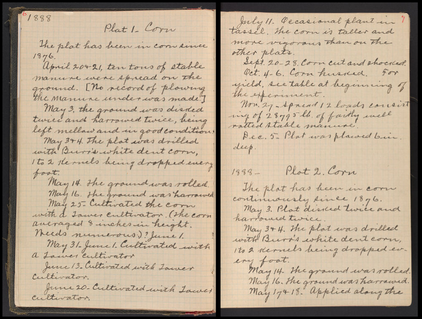
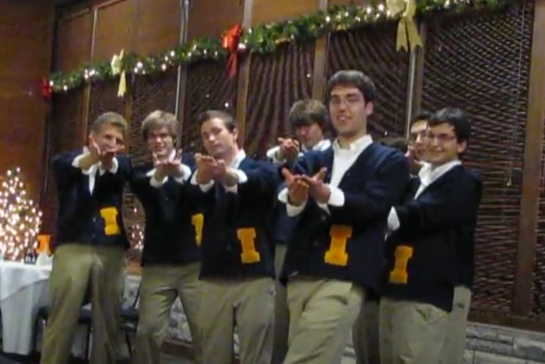
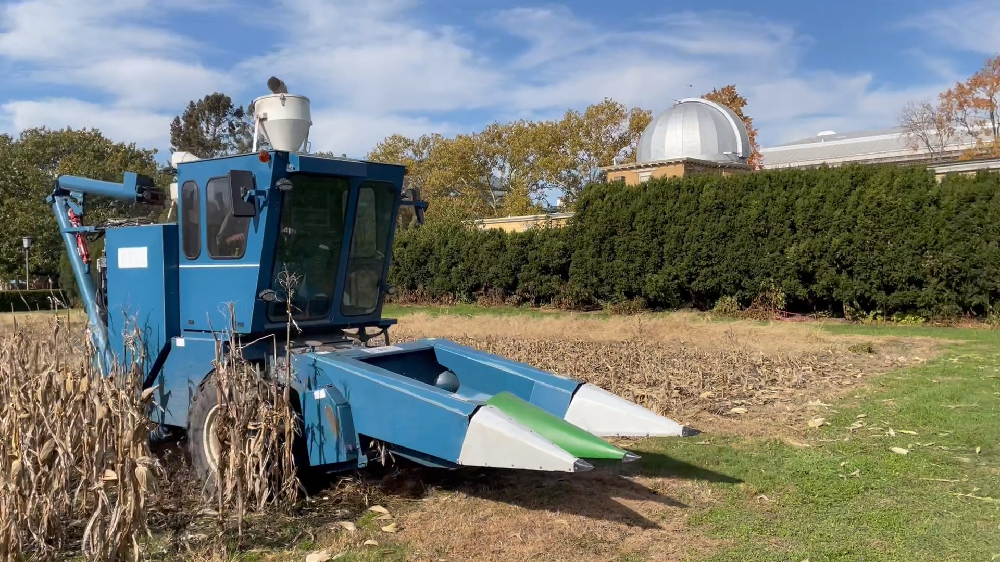

```{r, include = FALSE}
knitr::opts_chunk$set(
  collapse = TRUE,
  comment = "#>"
)
```

```{r setup}
library(morrowplots)
```

**The Morrow Plots may cover less than an acre but they loom large in the culture and history of the University of Illinois Urbana-Champaign. Here are just a few of the many fun artifacts and entertaining creations connected to this landmark at the heart of campus.**

## Archival Notebook

Page through this digital copy of [handwritten records](https://digital.library.illinois.edu/items/b9a74f70-51c5-0138-7202-02d0d7bfd6e4-9) from the first years of the Morrow Plots (1876-1913).

\

{width=50%}

\

## Radio Sketch

In 1947 the WILL Illinois Public Radio station dramatized the plots on an episode of Illini Unlimited. To hear the plots speak for themselves in this whimsical 10-minute radio play, [listen here.](https://digital.library.illinois.edu/items/e31e35f0-5131-0137-6caa-02d0d7bfd6e4-0)

\

## The Morrow Plots Song

Since 1970, campus a cappella and comedy group The Other Guys have been performing "The Morrow Plots Song" about the local legend that the Undergraduate Library was built underground so it wouldn't throw shade on the corn. (It was actually built underground to maintain an open space behind Foellinger Auditorium, but the legend makes for a better song.)

{width=50%}

See The Other Guys perform their [Morrow Plots Song](https://youtu.be/97TyuKr-zco?si=t1lzfThqjnzg2xLv)

\

## Mini Combine

Who doesn't love a mini version of a big thing? It's always fun to catch a glimpse of the unusually small machines out in the field. 

{width=50%}
